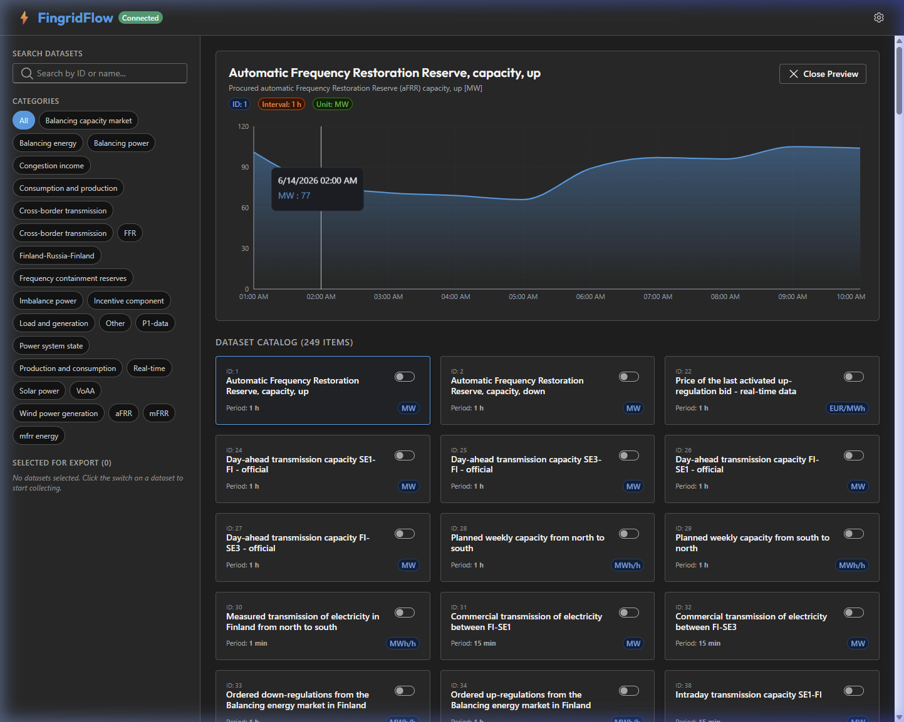

# FingridFlow — Fingrid Open Data Collector

A self-hosted tool that retrieves metrics from the new Fingrid Open Data API and exports them to InfluxDB. It features a beautiful, responsive dataset catalog browser and interactive live-preview charts.



---

## Features

- 📊 **Dynamic Catalog Browser** — Search and browse all 249+ Fingrid variables (wind power, solar, aFRR, frequency, nuclear output, etc.) with client-side searching and category filtering.
- 📈 **Interactive Live Preview** — Click on any dataset to instantly load its last 24 hours of data in a sleek, animated area chart.
- ⏱️ **Rate-Limit Resilient** — Designed defensively around Fingrid's 1 call per 2 seconds rate limit. The backend sequentially throttles queries and automatically retries requests on hitting `429 Too Many Requests`.
- 📡 **InfluxDB Export** — Syncs your selected datasets to InfluxDB on a configurable interval.
- 🐳 **Single Docker Container** — Compiled Axum backend + React frontend bundled together in a single container.
- 🔒 **Secure Credentials** — Credentials and configuration are saved locally on your host machine and never exposed.

---

## Quick Start

### 1. Build and Run the App

Ensure you have Docker and Docker Compose installed, then run:

```bash
docker compose up -d --build
```

### 2. Configure Settings

1. Open the Web UI: `http://localhost:3001` (or your reverse proxy URL).
2. Enter your Fingrid API Key (get one free by signing up at [data.fingrid.fi](https://data.fingrid.fi/)).
3. Click the gear icon in the top-right to configure your InfluxDB URL, token, org, bucket, and sync interval.
4. Toggle the switches on the datasets you want to collect and enable the Background Collector.

---

## Running Behind Caddy Reverse Proxy

FingridFlow is built with a relative base path, meaning it works out of the box behind subpaths in reverse proxies like Caddy.

To route requests under `/fingridflow`, add the following to your Caddyfile:

```caddy
your-domain.com {
    # 1. Enforce trailing slashes
    redir /fingridflow /fingridflow/

    # 2. Reverse proxy handler
    handle_path /fingridflow* {
        reverse_proxy fingrid-collector:3000
    }
}
```

---

## Technical Stack

| Layer | Technology |
|---|---|
| Backend | Rust, Axum, reqwest, tokio, chrono |
| Frontend | React 19, TypeScript, Vite, Fluent UI v9, Recharts |
| Container | Docker, Alpine Linux |

---

## Data Schema

Measurements are stored using this InfluxDB Line Protocol schema:

```
fingrid,dataset_id=<id>,dataset_name=<escaped_name>,unit=<escaped_unit> value=<float_value> <timestamp_seconds>
```
