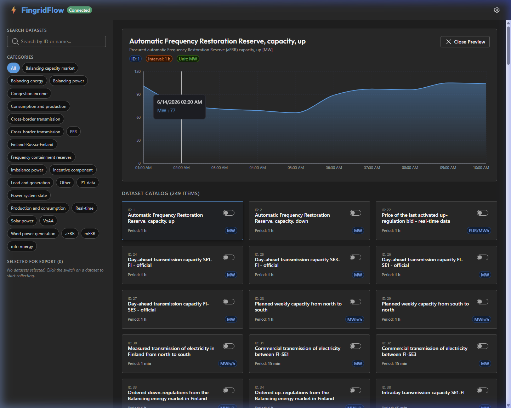

# FingridFlow — Fingrid Open Data Collector

A self-hosted tool that retrieves metrics from the new Fingrid Open Data API and exports them to InfluxDB. It features a mobile-first dataset catalog browser and interactive live-preview charts.



---

## Features

- 📱 **Mobile-First UI** — Built for the phone first: a bottom tab bar, bottom-sheet filters and full-width charts, scaling up to a multi-column layout on tablets and desktops. Dark and light themes follow the system setting.
- 📊 **Dynamic Catalog Browser** — Search and browse all 249+ Fingrid variables (wind power, solar, aFRR, frequency, nuclear output, etc.) with client-side searching plus category, unit and collection-state filters.
- 📈 **Interactive Live Preview** — Open any variable to see its last 24 hours, 3 days or 7 days in an animated area chart, with latest / average / lowest / highest read out above it.
- ⏱️ **Rate-Limit Resilient** — Designed defensively around Fingrid's 1 call per 2 seconds rate limit. The backend sequentially throttles queries and automatically retries requests on hitting `429 Too Many Requests`.
- 📡 **InfluxDB Export** — Syncs your selected datasets to InfluxDB on a configurable interval.
- 🐳 **Single Docker Container** — Compiled Axum backend + React frontend bundled together in a single container.
- 🔒 **Secure Credentials** — Credentials and configuration are saved locally on your host machine and never exposed.

---

## Installation & Setup

### A. Production Setup (Recommended)

Run the installer command to download the compose files, initialize configuration placeholders, and prepare the directory:

```bash
curl -fsSL https://raw.githubusercontent.com/Saavuori/fingrid-data-collector/main/install.sh | bash
```

Move into the created directory and start the collector container:

```bash
cd fingrid-collector
docker compose up -d
```

### B. Building From Source (Development)

If you cloned the source code directly and want to build the Docker image locally:

1. **Initialize Configurations**: Create file placeholders first to prevent Docker from mapping the volume paths as directories on the host:
   ```bash
   touch backend/credentials.json backend/active_datasets.json backend/influx_config.json
   ```
2. **Build and Run**:
   ```bash
   docker compose up -d --build
   ```

---

## Configuration

1. Open the Web UI: `http://localhost:3001` (or your reverse proxy URL).
2. Enter your Fingrid API Key (get one free by signing up at [data.fingrid.fi](https://data.fingrid.fi/)).
3. Open **Settings** (the tab bar on a phone, the top navigation on a desktop) to configure your InfluxDB URL, token, org, bucket and sync interval, and to enable the Background Collector.
4. In **Explore**, flip the switch on each variable you want to collect. The **Collect** tab lists everything queued for export and shows the sync status.

---

## Running Behind Caddy Reverse Proxy

FingridFlow is built with a relative base path, meaning it works out of the box behind subpaths in reverse proxies like Caddy.

To route requests under `/fingridflow`, add the following to your Caddyfile:

```caddy
your-domain.com {
    # 1. Enforce trailing slashes
    redir /fingridflow /fingridflow/

    # 2. Reverse proxy handler
    handle_path /fingridflow* {
        reverse_proxy fingrid-collector:3000
    }
}
```

---

## Technical Stack

| Layer | Technology |
|---|---|
| Backend | Rust, Axum, reqwest, tokio, chrono |
| Frontend | React 19, TypeScript, Vite, Fluent UI v9, Recharts |
| Container | Docker, Alpine Linux |

---

## Data Schema

Measurements are stored using this InfluxDB Line Protocol schema:

```
fingrid,dataset_id=<id>,dataset_name=<escaped_name>,unit=<escaped_unit> value=<float_value> <timestamp_seconds>
```
