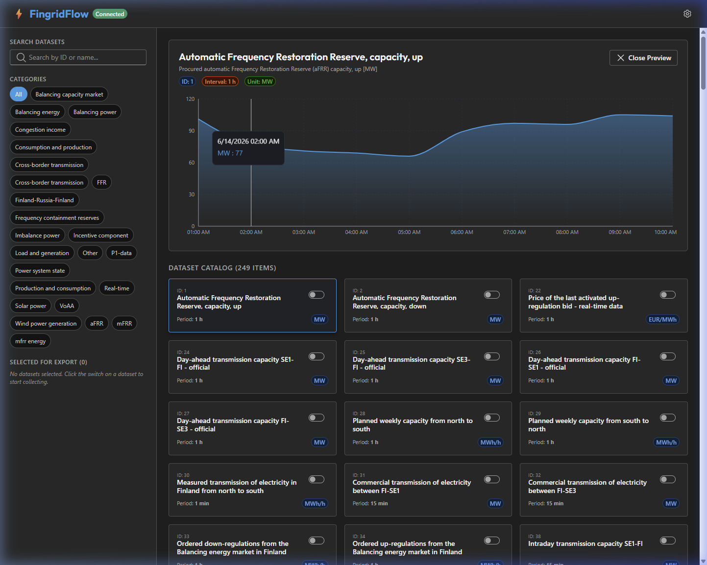

# FingridFlow — Fingrid Open Data Collector

A self-hosted tool that retrieves metrics from the new Fingrid Open Data API and exports them to InfluxDB. It features a mobile-first dataset catalog browser and interactive live-preview charts.

This repository builds two apps from one codebase:

| App | What it is | Image |
|---|---|---|
| **FingridFlow** (collector) | Private tool: log in with your key, pick datasets, export them to InfluxDB | `ghcr.io/saavuori/fingrid-data-collector` |
| **FingridFlow Live** (viewer) | Public, read-only dashboard of Finland's power system and every Fingrid dataset — no login, no collecting | `ghcr.io/saavuori/fingrid-data-collector-viewer` |

FingridFlow Live is described [below](#fingridflow-live--public-dashboard).



---

## Features

- 📱 **Mobile-First UI** — Built for the phone first: a bottom tab bar, bottom-sheet filters and full-width charts, scaling up to a multi-column layout on tablets and desktops. Dark and light themes follow the system setting.
- 📊 **Dynamic Catalog Browser** — Search and browse all 249+ Fingrid variables (wind power, solar, aFRR, frequency, nuclear output, etc.) with client-side searching plus category, unit and collection-state filters.
- 📈 **Interactive Live Preview** — Open any variable to see its last 24 hours, 3 days or 7 days in an animated area chart, with latest / average / lowest / highest read out above it.
- ⏱️ **Rate-Limit Resilient** — Designed defensively around Fingrid's 1 call per 2 seconds rate limit. The backend sequentially throttles queries and automatically retries requests on hitting `429 Too Many Requests`.
- 📡 **InfluxDB Export** — Syncs your selected datasets to InfluxDB on a configurable interval.
- 🐳 **Single Docker Container** — Compiled Axum backend + React frontend bundled together in a single container.
- 🔒 **Secure Credentials** — Credentials and configuration are saved locally on your host machine and never exposed.

---

## Installation & Setup

### A. Production Setup (Recommended)

Run the installer command to download the compose files, initialize configuration placeholders, and prepare the directory:

```bash
curl -fsSL https://raw.githubusercontent.com/Saavuori/fingrid-data-collector/main/install.sh | bash
```

Move into the created directory and start the collector container:

```bash
cd fingrid-collector
docker compose up -d
```

### B. Building From Source (Development)

If you cloned the source code directly and want to build the Docker image locally:

1. **Initialize Configurations**: Create file placeholders first to prevent Docker from mapping the volume paths as directories on the host:
   ```bash
   touch backend/credentials.json backend/active_datasets.json backend/influx_config.json
   ```
2. **Build and Run**:
   ```bash
   docker compose up -d --build
   ```

---

## Configuration

1. Open the Web UI: `http://localhost:3001` (or your reverse proxy URL).
2. Enter your Fingrid API Key (get one free by signing up at [data.fingrid.fi](https://data.fingrid.fi/)).
3. Open **Settings** (the tab bar on a phone, the top navigation on a desktop) to configure your InfluxDB URL, token, org, bucket and sync interval, and to enable the Background Collector.
4. In **Explore**, flip the switch on each variable you want to collect. The **Collect** tab lists everything queued for export and shows the sync status.

---

## Running Behind Caddy Reverse Proxy

FingridFlow is built with a relative base path, meaning it works out of the box behind subpaths in reverse proxies like Caddy.

To route requests under `/fingridflow`, add the following to your Caddyfile:

```caddy
your-domain.com {
    # 1. Enforce trailing slashes
    redir /fingridflow /fingridflow/

    # 2. Reverse proxy handler
    handle_path /fingridflow* {
        reverse_proxy fingrid-collector:3000
    }
}
```

---

## Technical Stack

| Layer | Technology |
|---|---|
| Backend | Rust, Axum, reqwest, tokio, chrono |
| Frontend | React 19, TypeScript, Vite, Fluent UI v9, Recharts |
| Container | Docker, Alpine Linux |

---

## Data Schema

Measurements are stored using this InfluxDB Line Protocol schema:

```
fingrid,dataset_id=<id>,dataset_name=<escaped_name>,unit=<escaped_unit> value=<float_value> <timestamp_seconds>
```

---

## FingridFlow Live — public dashboard

A read-only website in the spirit of Fingrid's [power system state](https://www.fingrid.fi/sahkomarkkinat/sahkojarjestelman-tila/) page, built to be published:

- **Grid now** — system state and shortage alerts, consumption, production, net import/export, frequency and CO₂ intensity with 24 h sparklines; production by source as a stacked 24 h chart with consumption on top; consumption and production with Fingrid's forecast for the next 24 h; live cross-border flows (SE1, SE3, Norway, Estonia) with direction.
- **All data** — every dataset in Fingrid's catalog, searchable in Finnish and English, filterable by category and unit. Each dataset opens with 24 h / 3 / 7 / 30 day ranges, forecasts drawn past a "Now" line, a table view, CSV download and a shareable link.
- **Suomi / English**, dark and light themes, works on a phone.

### How it protects the API key and the rate limit

Visitors never reach Fingrid. The API key stays on the server (an environment variable or podman secret), and every response comes from a shared server-side cache:

- The front page is one multi-dataset call, refreshed every ~2.5 minutes in the background.
- Dataset pages offer fixed ranges, so all visitors share one cached fetch per dataset and range (3 min to 1 h, depending on the range). Many visitors opening the same link cost one upstream call.
- Upstream calls are spaced ≥ 2.1 s apart and capped per day (`FINGRID_DAILY_LIMIT`, default 8000 of Fingrid's 10 000). If Fingrid fails, the last good copy is served.

### Deploying on a server with podman (Quadlet)

The image is published by CI on every push to `main`. GHCR creates new packages as **private**: either make `fingrid-data-collector-viewer` public (GitHub → Packages → Package settings → Change visibility), or run `podman login ghcr.io` on the server with a token that has `read:packages`.

On the server, as the user that runs your containers:

```bash
curl -fsSL https://raw.githubusercontent.com/Saavuori/fingrid-data-collector/main/deploy/viewer/install.sh | bash
```

It asks for your Fingrid API key once, stores it as the podman secret `fingrid_api_key`, installs [`fingrid-viewer.container`](deploy/viewer/fingrid-viewer.container) as a user systemd service listening on `127.0.0.1:3010`, and enables `podman auto-update` so new images from CI roll out automatically. Then route Caddy to it, on its own domain or under a path such as `/fingrid/` — see [`Caddyfile.example`](deploy/viewer/Caddyfile.example).

For Docker or podman-compose instead, use [`deploy/viewer/compose.yaml`](deploy/viewer/compose.yaml).

| Variable | Default | |
|---|---|---|
| `FINGRID_API_KEY` | — | Your key, or `FINGRID_API_KEY_FILE` pointing at a file holding it |
| `FINGRID_DAILY_LIMIT` | `8000` | Upstream calls allowed per UTC day |
| `PORT` | `3000` | Listen port inside the container |

`GET /api/health` reports whether the front page is fresh and how many Fingrid calls were made today.

### Developing the viewer

```bash
# backend on :3002
cd backend && FINGRID_API_KEY=... PORT=3002 DIST_DIR=../frontend/dist-viewer cargo run --bin fingrid-viewer
# frontend dev server, proxying /api to :3002
cd frontend && npm run dev:viewer
```

The viewer's frontend lives in `frontend/src/viewer` and shares the theme and UI components with the collector; `npm run build:viewer` builds it to `frontend/dist-viewer`. The backend is `backend/src/bin/fingrid-viewer`, sharing the Fingrid client in `backend/src/fingrid_client.rs`.

Data: [Fingrid Open Data](https://data.fingrid.fi), licensed CC BY 4.0. The dashboard credits it in its footer; keep that if you change the page.

